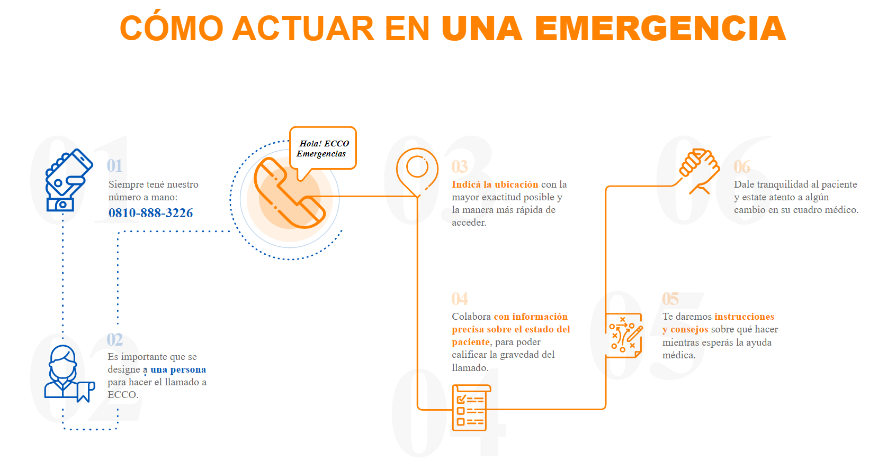
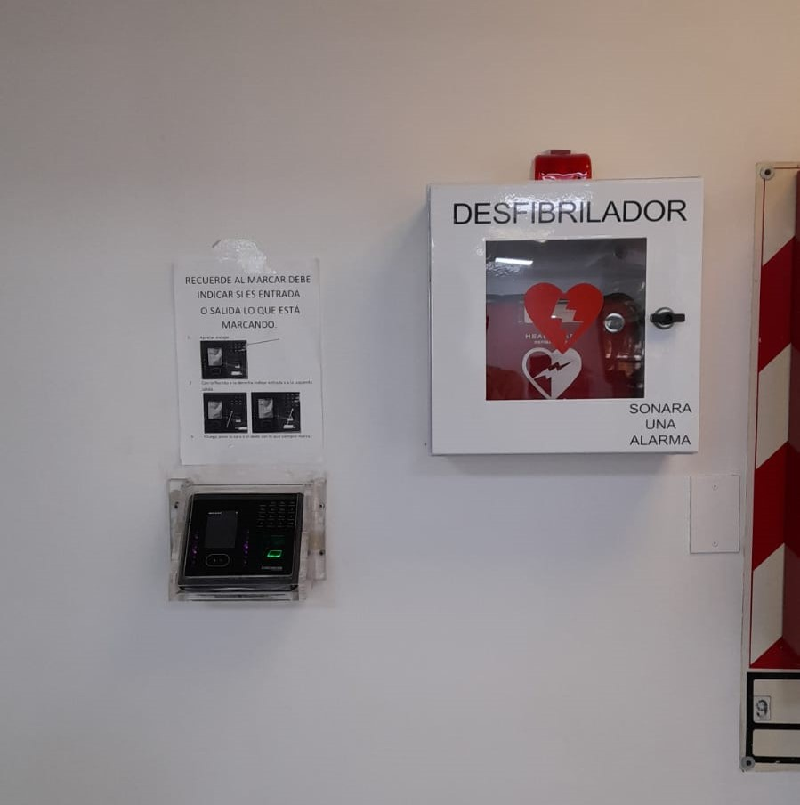

# Emergencias Médicas

## :telephone\_receiver::ambulance: **0810-888-3226    ECCO**

<figure><figcaption></figcaption></figure>


### **AVISAR A RECEPCIÓN**&#x20;

Luego de llamar al servicio de emergencias, **dar aviso a la recepción de FUESMEN** (personal administrativo y/o de seguridad emplazado emplazado en el ingreso), a fin de que apenas llegue la ambulancia, pueda ser guiado directo al lugar requerido. -\
\
Por más precisión que se le de a la telefonista, habitualmente dicha precisión no llega al personal de la ambulancia, por lo que al llegar a recepción no tienen claro a dónde dirigirse dentro del edificio.


<mark style="color:orange;">Sedes con cobertura y más información:</mark>

**Sedes con cobertura**

* Sede Mendoza (Garibaldi 405 y 393)
* Garibaldi 374
* COIR (Garibaldi 405 Patio Interno)
* San Rafael
* Maipú

Sedes en hospitales Italiano, Scaravelli, Universitario y El Carmen, atenderán las emergencias en esos establecimientos

Más información en [PDF adjunto](https://2824384839-files.gitbook.io/~/files/v0/b/gitbook-x-prod.appspot.com/o/spaces%2FDlIiILJdOG4ftAMU20kj%2Fuploads%2FTt1a0Q8SUgLm9qfnK5MV%2Farea%20protegida_2022_05_31_13_09_11_359.pdf?alt=media\&token=b3d3ebf0-e0c7-4542-ac6c-f09bb823bc34)

<mark style="color:orange;">**Más información de ECCO Emergencias:**</mark>

[https://www.ecco.com.ar/individuales/st/emergencias](https://www.ecco.com.ar/individuales/st/emergencias)

## Ubicación de los DEA (Desfibrilador Externo Automático)

### DEA 1: Garibaldi 405, al lado del reloj donde se marca el ingreso

<figure><figcaption></figcaption></figure>

:red\_circle: Se ubica en planta baja, pasillo sur.

> Recordar que este DEA, podrá ser manipulado por todo el personal

### DEA 2: Garibaldi 405, Segundo Subsuelo, Anestesia

:red\_circle: Se encuentra en las estanterías de la sala de anestesia

> Recordar que este DEA, podrá ser manipulado por todo el personal

##

## Ubicación de Carros de Paro CON Cardiodesfibrilador

### Garibaldi 405, Primer Piso, Cámara Gamma

:red\_circle:Sala de Ergometrías

> Recordar que este equipamiento SOLO debe ser manipulado por personal médico calificado

### Montecaseros 1020, Resonador COIR

:red\_circle:Sala de Recuperación de Anestesia

> Recordar que este equipamiento SOLO debe ser manipulado por personal médico calificado

### Garibaldi 393, Primer Piso, Gimnasio

:red\_circle:Sala general del gimnasio, detrás del mueble de recepción

> Recordar que este equipamiento SOLO debe ser manipulado por personal médico calificado

### Sede Maipú

:red\_circle: Ubicación a confirmar

##

## Ubicación de Carro de Paro SIN Cardiodesfibrilador

### Garibaldi 405, Planta Baja, Recepción - Información

:red\_circle:En el escritorio interno
